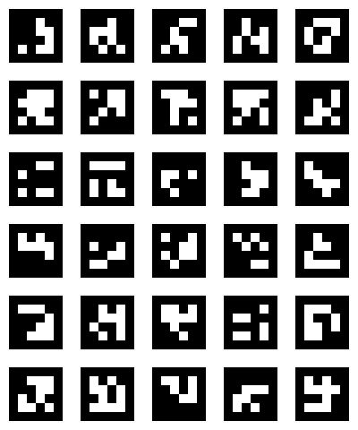

# apriltag-renderer

This library for both web/HTML5 and Node generates [AprilTag](https://github.com/AprilRobotics/apriltag) images in the following families:

| Family           | Number of Tags | Size | Example                                                |
| ---------------- | -------------- | ---- | ------------------------------------------------------ |
| Tag16h5          | 30             | 8    |           |
| Tag25h9          | 35             | 9    |           |
| Tag36h9          | 5329           | 10   |           |
| Tag36h10         | 2320           | 10   |          |
| Tag36h11         | 587            | 10   |          |
| TagCircle21h7    | 38             | 9    |     |
| TagCircle49h12   | 65,698         | 11   |    |
| TagCustom48h12   | 42,211         | 10   |    |
| TagStandard41h12 | 2115           | 9    |  |
| TagStandard52h13 | 48,714         | 10   |  |

It provides methods to draw AprilTags from these families onto a canvas at any size (both HTML5 on the web and [node-canvas](https://www.npmjs.com/package/canvas/v/2.0.0-alpha.7) are supported), generate tag SVGs, and render tags as unicode text suitable to draw in the terminal or in a CLI. It also provides an API to get the raw positional data for each tag so you can create your own renderer if none of those are quite what you want.

## Examples

### Rendering an AprilTag onto a canvas on web

```ts
const canvas = document.createElement("canvas");
canvas.width = 80;
canvas.height = 80;

const aprilTagFamily = new AprilTag16h5();
const tagId = 0;
aprilTagFamily.renderToCanvas(tagId, canvas);
```

### Rendering an AprilTag onto a canvas in NodeJS, and saving it as a PNG

```ts
import { createCanvas } from "canvas";
import { writeFileSync } from "node:fs";

const canvas = createCanvas(80, 80);

const aprilTagFamily = new AprilTag16h5();
const tagId = 0;
aprilTagFamily.renderToCanvas(tagId, canvas);
writeFileSync(`${tagId}.png`, canvas.toBuffer());
```

### Rendering a whole family of AprilTags onto one canvas

```ts
const aprilTagFamily = new AprilTag16h5();
const size = aprilTagFamily.size * 10;
const columns = 5;
const rows = Math.ceil(aprilTagFamily.maxId / columns);

const canvas = createCanvas(columns * size, rows * size);

for (let tagId = 0; tagId < aprilTagFamily.maxId; tagId++) {
  const column = tagId % columns;
  const row = Math.floor(tagId / columns);

  aprilTagFamily.renderToCanvas(tagId, canvas, {
    position: {
      x: column * size,
      y: row * size,
      size,
    },
  });
}
writeFileSync(`${aprilTagFamily.familyName}.png`, canvas.toBuffer());
```

This produces a result like:



### Rendering an AprilTag with different colours

```ts
const aprilTagFamily = new AprilTagCircle49h12();
const tagId = 0;
aprilTagFamily.renderToCanvas(tagId, canvas, {
  blackColor: "#f00",
  whiteColor: "#fa0",
});
```

This produces a result like:


### Rendering an AprilTag as an SVG

```ts
const aprilTagFamily = new AprilTag16h5();
const tagId = 0;
const svg = aprilTagFamily.renderToSvg(tagId);
```

This returns an SVG like:

```svg
<svg xmlns="http://www.w3.org/2000/svg" viewBox="0 0 8 8">
  <path d="M1,1v1h1v-1zM2,1v1h1v-1zM3,1v1h1v-1zM4,1v1h1v-1zM5,1v1h1v-1zM6,1v1h1v-1zM1,2v1h1v-1zM2,2v1h1v-1zM3,2v1h1v-1zM5,2v1h1v-1zM6,2v1h1v-1zM1,3v1h1v-1zM2,3v1h1v-1zM3,3v1h1v-1zM6,3v1h1v-1zM1,4v1h1v-1zM2,4v1h1v-1zM3,4v1h1v-1zM4,4v1h1v-1zM6,4v1h1v-1zM1,5v1h1v-1zM3,5v1h1v-1zM6,5v1h1v-1zM1,6v1h1v-1zM2,6v1h1v-1zM3,6v1h1v-1zM4,6v1h1v-1zM5,6v1h1v-1zM6,6v1h1v-1z" fill="#000"/>
  <path d="M0,0v1h1v-1zM1,0v1h1v-1zM2,0v1h1v-1zM3,0v1h1v-1zM4,0v1h1v-1zM5,0v1h1v-1zM6,0v1h1v-1zM7,0v1h1v-1zM0,1v1h1v-1zM7,1v1h1v-1zM0,2v1h1v-1zM4,2v1h1v-1zM7,2v1h1v-1zM0,3v1h1v-1zM4,3v1h1v-1zM5,3v1h1v-1zM7,3v1h1v-1zM0,4v1h1v-1zM5,4v1h1v-1zM7,4v1h1v-1zM0,5v1h1v-1zM2,5v1h1v-1zM4,5v1h1v-1zM5,5v1h1v-1zM7,5v1h1v-1zM0,6v1h1v-1zM7,6v1h1v-1zM0,7v1h1v-1zM1,7v1h1v-1zM2,7v1h1v-1zM3,7v1h1v-1zM4,7v1h1v-1zM5,7v1h1v-1zM6,7v1h1v-1zM7,7v1h1v-1z" fill="#fff"/>
</svg>
```

### Rendering an AprilTag as text for use in a terminal / CLI

```ts
const aprilTagFamily = new AprilTag16h5();
const tagId = 0;
const svg = aprilTagFamily.renderToText(tagId);
```

This returns a result like:

```

  ██████
  ███ ██
  ███  █
  ████ █
  █ █  █
  ██████

```

(this is best viewed with a font where the Unicode block character is displayed as a square)

### Creating your own custom renderer

Here's an ASCII version of the text renderer above, using `#` characters rather than the Unicode block:

```ts
const aprilTagFamily = new AprilTag16h5();
const tagId = 0;

const text = aprilTagFamily
  .getBitmap(tagId)
  .map((row) => row.map((cell) => (cell === "b" ? "#" : " ")).join(""))
  .join("\n");
```

This returns a result like:

```

 ######
 ### ##
 ###  #
 #### #
 # #  #
 ######

```

## Documentation

Create an instance of the AprilTag family class for the tag family that you want to generate for --- e.g. `new AprilTag16h5()` if you want to generate 16h5 codes, `new AprilTagStandard52h13()` if you want to generate Standard52h13 codes.

The class you instantiate can be used as a singleton / used to render many codes.

The API is identical across all tag family classes, and contains the following:

- `.familyName`: name of the tag family, e.g. `16h5`
- `.size`: how many "cells" wide/high the tag is (all tags are square, so this is all you need)
- `.maxId`: how many tags are in the family. Note that because tag ids start at 0, this value is exclusive.
- `.isIdInRange(tagId)`: returns a boolean indicating if a given `tagId` is in range for the AprilTag family you're using,
- `.renderToCanvas(tagId, canvas, options)`: renders the tag to a canvas. `options` is optional, and can contain the following:

  - `blackColor`: the color to use instead for the parts of the AprilTag that are typically rendered in black
  - `whiteColor`: the color to use instead for the parts of the AprilTag that are typically rendered in white
  - `position`: an `{x, y, size}` object specifying where to place the tag on the canvas. If this isn't provided, the tag takes up the entire canvas. `x`,`y` represents the top-left corner of the tag.

  > **Note**: `renderToCanvas` throws if the size of either the canvas or the requested size in the `position` option (depending on which is being used) is not a multiple of the tag family size; since all AprilTags are square, and we don't support rendering stretched / cropped ones.

- `.renderToSvg(tagId, options)`: returns a string containing the tag as an SVG. `options` is optional, and can contain the following:

  - `blackColor`: the color to use instead for the parts of the AprilTag that are typically rendered in black
  - `whiteColor`: the color to use instead for the parts of the AprilTag that are typically rendered in white

- `.renderToText(tagId)`: returns a string containing the tag drawn using Unicode box drawing characters
- `.getBitmap(tagId)`: returns a square 2d array containing a representation of the visual cells that make up the AprilTag. Each cell is either `"w"` if it would be drawn as white in in the tag, `"b"` if it would be drawn as black in the tag, or `"x"` if it would be transparent in the tag (e.g. for Circle21h7, Circle49h12, etc).

  Since this gives you the raw data that composes the tag, this allows you to create your own tag renderer.

## How AprilTags are generated

Unlike QR codes, the individual cells/pixels that make up an AprilTag have no inherent meaning --- instead of following some standard that defines how to encode e.g. a "0", a "1", a "2" etc, there are just instead some arbitrary tags which have been picked that map to those values.

As such, it isn't really possible to write a library that really "generates" AprilTags on the fly (you can technically do this, as it was a script that came up with the original mappings, but it would be _very_ slow, since each AprilTag considers all the tags that came before, and requires those to be generated first --- one of their heuristics is that each tag shouldn't be too similar to the others).

Instead, the best way to ship an AprilTag renderer is to precompute the pixel/cell layout for each tag ahead of time, and then to just render it in different ways. For this reason, this library is somewhat large, at ~1.8mb, as it has to include the binary data for all the code families. However, it is tree-shakable, so in your builds you will only include the binaries for the tag families that you use, and it is still better than some alternatives, which simply export pre-rendered PNGs / SVGs for each tag, whereas in this library the layout position for a single tag is represented as a single 64-bit binary int.

## Credits

This project is, in many places, a TypeScript port of the original April Robotics [apriltag-generation](https://github.com/AprilRobotics/apriltag-generation) Java package; it is where I sourced the lists of binary data that define each of tag families, and it is also where I based a lot of the core binary -> bitmap logic from.

Please see [THIRD_PARTY_LICENSES.md](./THIRD_PARTY_LICENSES.md) for more information.
